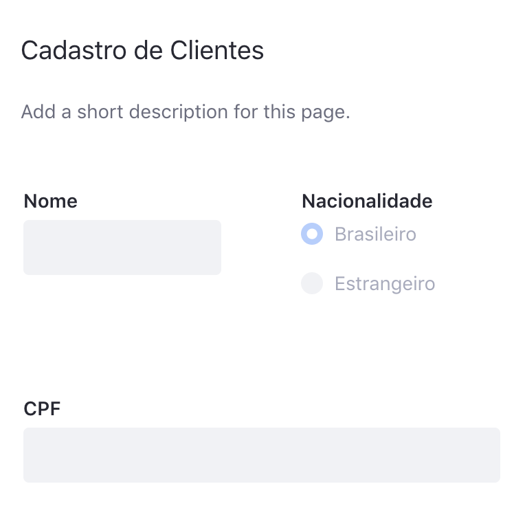

Pode-se distinguir 3 principais partes do Forms: A [User View](#user-view): parte que somente renderiza os formulários, [Form Builder](#form-builder-view): parte que cuida da criação desses formulários, assim como a Sidebar e a [Rule Builder View](#rule-builder-view): que toma de conta do criador de regras.

# User View

O User View é a parte da aplicação que é apresentada para o usuário final. Lá, o formulário que foi criado no [Form Builder](#form-builder-view) é renderizado para o usuário: Todos os fields são renderizados seguindo o layout montado e as regras definidas no [Rule Builder View](#rule-builder-view), bem como as regras de validação de valores são executadas caso o usuário altere algum field gerenciado por alguma regra.

Não existe muito o que dizer sobre essa parte, ela é uma parte representacional da estrutura de um formulário montada previamente pelo [Form Builder](#form-builder-view) e o [Rule Builder View](#rule-builder-view).

# Form Builder View

Basicamente o Form Builder permite ao usuário montar como será o **layout** dos fields exibidos no User View. Nele fica o componente de Sidebar que permite a adição de fields ao formulário via **Drag and Drop** e também permite a configuração de properiedades de um field - caso ele esteja selecionado.

Uma curiosidade sobre a **Sidebar** é que o formulário usado para configurar as propriedades de um Field é na verdade uma espécie de User View: Lá é uasada a própria API do Forms para renderizar aquele formulário e, caso aquele form tenha regras, elas serão executadas. Entraremos em mais detalhes sobre isso mais a frente. Por agora é suficiente saber que a **Sidebar usa a mesma API de renderização do Forms para rendrizar fields dentro dela**.

# Rule Builder View

O Rule Builder é a ferramenta que permite aos usuários adicionar comportamento aos formulários. É muito comum ao se criar formulários que o preenchimento de um field dependa de alguma condição (como o valor de outro field).

Tomemos como exemplo o seguinte formulário:

Caso o usuário responda que é estrangeiro, o campo de CPF passa a não fazer mais sentido. O Rule Builder permite montar uma regra que esconde o campo *CPF* caso o campo *Nacionalidade* não seja igual a "Brasileiro".

# Resumindo

É isso. Falamos um pouco sobre as 3 principais partes da aplicação sem entrar em detalhes sobre a implementação. Nas próximas partes vamos ver um pouco de teoria e padrões de projeto que nos ajidarão a entender como essa aplicação foi construida.